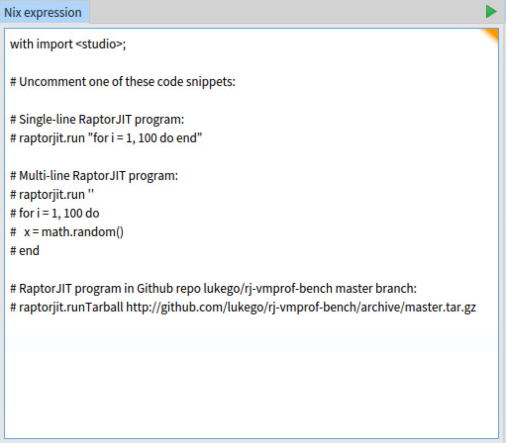
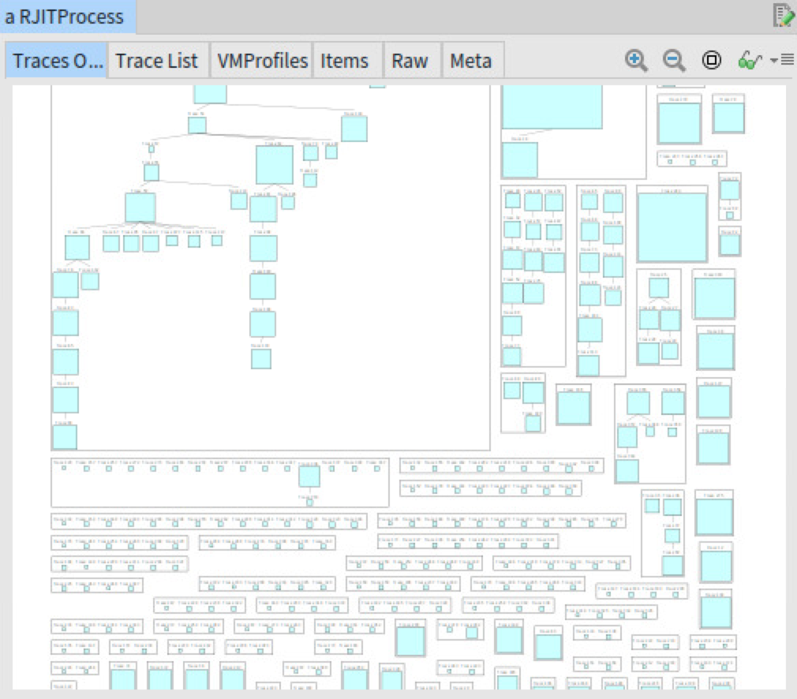
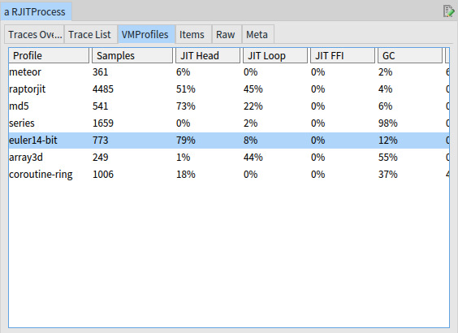
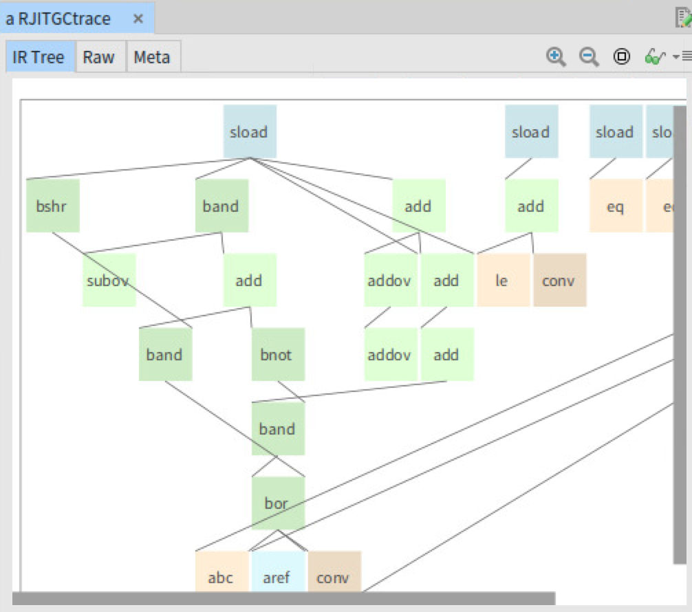

# Studio

Studio is a productive environment for working on your programs.

Think of Studio as the programmer's virtual counterpart to the artist
studio; the mechanic workshop; a doctor surgery. It is a workspace
that you can fill with the tools that help you do your work, where
they will all be within easy reach when you want them.

Unlike a traditional IDE, you don't write your source code in Studio.
Instead you collect a suite of specialist tools that help you develop
your own specific application. This could include profilers like Intel
VTune, protocol analyzers like Wireshark, testers like Valgrind, and
so on. You can either build these tools yourself or import existing
ones, depending on the situation.

Studio is very new. The first applications being supported are
[RaptorJIT](https://github.com/raptorjit/raptorjit) and
[Snabb](https://github.com/snabbco/snabb). There is room for hundreds
more!

## Design

Studio is composed of two halves:

The **frontend** provides a graphical user interface based on
[Pharo](http://pharo.org/) using the "[moldable tools](http://scg.unibe.ch/news/2016-10-02_23-15-02Chis16d)" approach of the
[Glamorous Toolkit](http://gtoolkit.org/).

The **backend** produces data for the frontend using the flexibility of [Nix](http://nixos.org/nix/) to make use of practically any software in the universe.

## Status

Studio is currently suitable for extreme-early-adopters who are
interested in experimenting with RaptorJIT code.

## Installation

Studio is a GUI application that runs on Linux/x86-64. You can run
Studio locally (X11 mode) or remotely (VNC mode.) The default
installation supports both options "out of the box."

macOS users are advised to use VNC mode with Studio running on a
server, a cloud VM, a Docker container, a VirtualBox VM, etc.

#### Prerequisite: Nix

Studio is installed using the Nix package manager. You need
to [install Nix](https://nixos.org/nix/) before installing Studio.

Here is a one-liner for installing Nix:

```
$ curl https://nixos.org/nix/install | sh
```

#### Installing Studio

You can install Studio directly from a source tarball. Here is the
command to install the current master branch:

```
$ nix-env -iA studio -f https://github.com/studio/studio/archive/master.tar.gz
```

You can rerun this command at any time to install the latest release.
If you want to install a different version, from a particular tag or
branch of repository, then you only need to update the URL.

## Running

You can run the Studio GUI either locally (X11) or remotely (VNC.) The
command `studio-x11` runs the GUI directly on your X server while the
command `studio-vnc` creates a VNC desktop running Studio for remote
access.

```
$ studio-x11
$ studio-vnc [extra-vncserver-args...]
```

The VNC server used is `tigervnc`.

### VNC and SSH remote access tips

- The recommended VNC client is `tigervnc` which supports automatically resizing the desktop to suit the client window size. On macOS with Homebrew you can install tigervnc with `brew cask install tigervnc-viewer` and then run `vncviewer <server>[:display]`.
- Using SSH:
    - Start a long-lived Studio session: `ssh <server> studio-vnc [:display]`. If no display is specified then an available one is assigned automatically.
    - Setup SSH port forwarding to (e.g.) display 7: `ssh -L 5907:localhost:5907 <server>`.
    - Connect with VNC client to (e.g.) display 7 over SSH forwarded port: `vncviewer localhost:7`.
    - Shut down a Studio sessions: `ssh <server> vncserver -kill <:display>`.
- See how the VNC setup is put together in [`backend/frontend/default.nix`](backend/frontend/default.nix).

### Using Studio

Studio opens to an "Inspector" window where you can enter a Nix expression and then evaluate by pressing the green arrow.



Here are some samples that you can copy-and-paste for running RaptorJIT code in different ways:

```nix
with import <studio>;
# One-liner using Nix "..." string syntax.
raptorjit.run "for i = 1, 100 do end"
```

```nix
with import <studio>;
# Multi-liner using Nix ''...'' string syntax.
raptorjit.run ''
  for i = 1, 100 do
    x = math.random()
  end
''
```

```nix
with import <studio>;
# Download a tarball and evaluate *.lua inside
raptorjit.runTarball http://github.com/lukego/rj-vmprof-bench/archive/master.tar.gz
```

The result of your expression will be inspected in a new pane to the right:



You can click on individual objects to open them in new Inspector panes:







and you can backtrack to previous panes, or resize the number of panes that are visible at one time, using the controls at the bottom:


