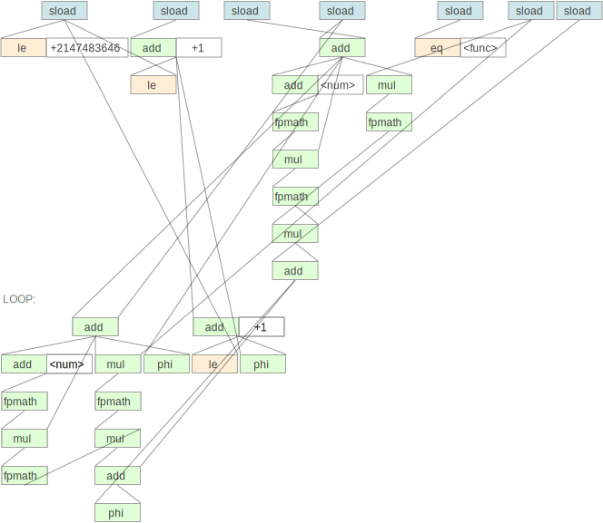

# Studio

Studio is an interactive software diagnostics environment.

Studio imports dense and "messy" diagnostic data in an application's
own native formats, then it applies all the tools that are needed to
extract useful information, and finally it presents the results in an
interactive graphical user interface.

### Getting Started

Studio runs on Linux/x86. You can run it anywhere (server, VM, docker,
etc) and access the GUI with VNC.

Here is how to download and run Studio:

```shell
$ curl https://nixos.org/nix/install | sh    # Get nix package manager
$ git clone https://github.com/studio/studio # Get Studio
$ studio/run vnc                             # Start GUI as VNC server
```

And in a docker container:

```shell
$ git clone https://github.com/studio/studio      # Get Studio
$ docker build -t studio studio                   # Build docker image from local git repo
$ docker run -d -p 127.0.0.1:5901:5901 studio vnc # Run studio in the background in VNC mode, listening on localhost:5901
$ vncviewer 127.0.0.1:5901                        # Connect to studio using TigerVNC
```

Optional extras:

```shell
$ git checkout next            # Switch to development version
$ studio/run x11               # Start GUI directly as X11 client
```

Script you can enter to get some example data:

```
with import <studio>;
raptorjit.runTarball https://github.com/lukego/rj-vmprof-bench/archive/master.tar.gz
```

----

<p align="center">  <br/> RaptorJIT IR visualization example </p>

