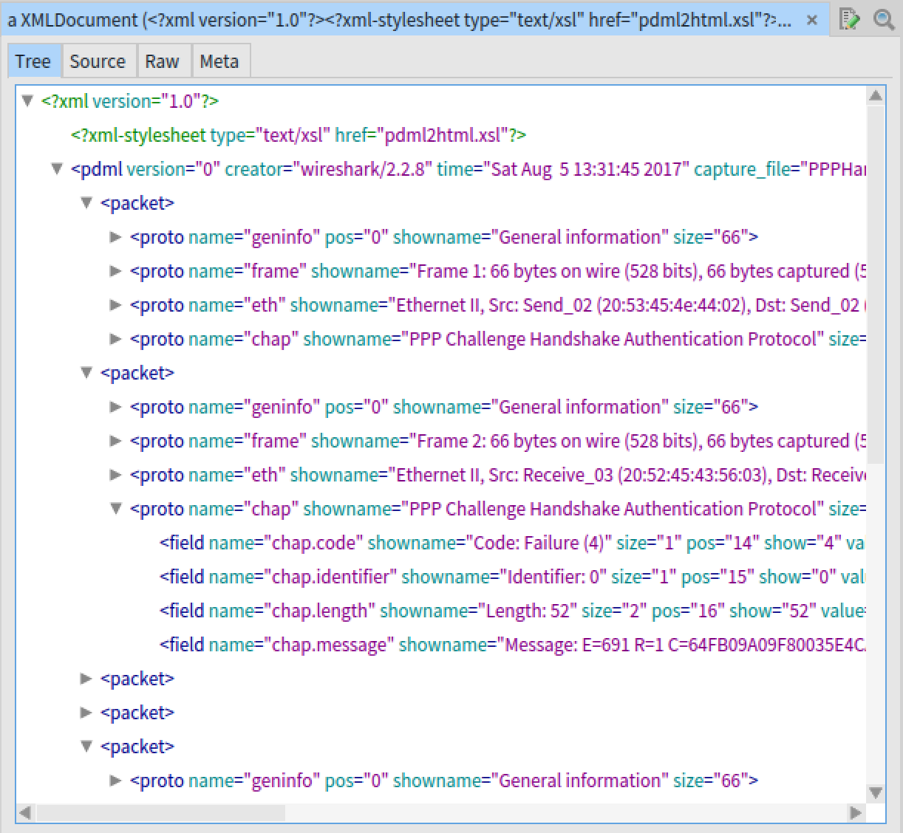
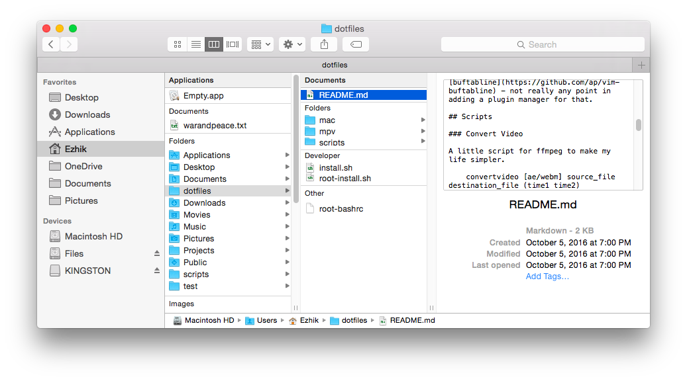
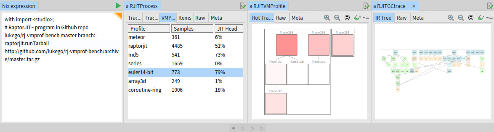
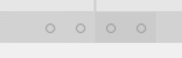

% Studio: a productive environment for working on your programs.

# Introduction

Studio is a debugger for the data produced by complex applications.
First, Studio imports dense and "messy" data in an application's own
native formats, then it processes the data to extract useful
information, and finally it presents the results with an interactive
graphical user interface.

Studio is particularly intended for complex applications with many
moving parts. JIT compilers, network stacks, databases, operating
system kernels, and so on. These applications are not especially well
served by ad-hoc scripts based on gdb, graphviz, gnuplot, perl, and so
on, but nor do they justify building fancier tools from scratch.
Studio bridges this gap by providing a readily extensible framework
that new applications can be added into without too much work.

How does Studio make this easier than doing everything yourself? Just
by combining a couple of very powerful tools: Nix for processing data
and Pharo for user interaction. 

Nix makes it easy to incorporate other tools, whether that is
something simple like calling R with your favourite libraries loaded,
or running a custom Python program, more exotic like a virtual
machines with special CPU arch or operating system that runs some
awkward third-party diagnostic tools.

Pharo makes it easy to visually inspect data structures like graphs of
objects. Pharo itself is a full-scale modern Smalltalk development
environment, the [Agile Visualization](http://agilevisualization.com/)
toolkit makes it easy to map your data onto visual objects that you
can manipulate, and the [Glamorous Toolkit](http://gtoolkit.org/)
provides the tools for navigating and searching your data.

Do you have an application that deserves its own tools? Studio is
ready for you to extend. Screenshots galore can be found in
the [Supported Applications](Supported-Applications) section.

## How Studio Works

Studio is built on three main abstractions: _products_, _builders_, and _presentations_. Products are raw data on disk; builders are scripts that can create products; presentations are graphical views of products.

### Products

A product is raw data - a directory on disk - in a well-defined
format. Each product has a named _type_ that informally defines the
layout of the directory and the characteristics of the files. The type
is always specified in a file named `.studio/product-info.yaml`.

For a running example, let us define a product type called
`xml/packet-capture/pdml` that represents a network packet capture in
XML format. Here is how we informally define this product type:

- The file `.studio/product-info.yaml` will include `type: xml/packet-capture/pdml`.
- The file `packets.pdml` will exist at the top-level.
- `packets.pdml` will contain network packets in the [PDML](https://wiki.wireshark.org/PDML) XML format defined by Wireshark.

This simple product definition defines the interface between builders,
that have to produce directories in this format, and presentatins that
will display those directories to the user.

Digression: One can imagine many other product types. For example, a
type `application/crash-report` might represent debug information
about an application that has crashed and include the files `exe` (an
ELF executable with debug symbols), `core` (a core dump at the point
of the crash), `config.gz` (Linux kernel configuration copied from
`/proc/config.gz`), and so on. Such products could serve as
intermediate representations from which to derive other products, like
high-level summaries or low-level disassembly of the relevant
instructions, using tools like `gdb` and `objdump` and so on.

### Builders

A builder is a script - a Nix derivation - that creates one or more
products. The builder takes some inputs - parameters, files, URLs,
output of other builders, etc - and uses them to produce a
product. Certain builders have simple high-level APIs that are easy
for users to call interactively. Other builders have intricate APIs
and are used as component parts of higher-level builders.

A builder also takes all of the software that it requires as an
input. This is completely natural with Nix. If specific software is
needed, in specific versions, from specific Git branches, with
specific patches, etc, then it can be provided with Nix. Indeed, most
common software packages are already available out of the box from the
`nixpkgs` package repository and can easily have their versions
overridden.

For example, let us define a builder that takes for input the URL of a packet capture in binary `pcap` file format and for output creates a product of type `xml/packet-capture/pdml`.

```nix
# pdml api module
pdml = {
  # inspect-url function
  inspect-url = pcap-url:
    runCommand "pdml-from-pcap-url"
      # inputs
      {
	pcap-file = fetchurl pcap-url;
	buildInputs = [ wireshark ];
      }
      # build script
      ''
	mkdir -p $out/.studio
	echo 'type: xml/packet-capture/pdml' > $out/.studio/product-info.yaml
	tshark -t pdml -i ${pcap-file} -o $out/packets.pdml
      '';
}
```

This builder can be invoked in a script like this:

```nix
pdml.inspect-url http://my.site/foo.pcap
```

and it will produce a Studio product as a directory in exactly the
expected file format.

Note: We have specified our software dependency simply with the name
`wireshark`. This means that Studio will download and use the default
version in the base version of nixpkgs. That is, Studio would always
use exactly the same version of wireshark no matter where it is
running. If we wanted to use a more specific version, or apply patches to
support some new experimental protocols, etc, then this would be
straightforward with Nix.

### Presentations

A presentation is an interactive user interface - a live Smalltalk object - that presents a product (or a component part of a product) to the user. The input to the presentation is a product stored on the local file system. The presentation code then adds new _view_ tabs to the inspector.

```smalltalk
StudioPresentation subclass: #PDLPacketCapturePresentation
  instanceVariableNames: 'xml'
  classVariableNames: ''
  package: 'Studio-UI'
```

```smalltalk
PDLPacketCapturePresentation class >> supportsProductType: type
   ^ type = 'xml/packet-capture/pdl'.
```

```smalltalk
PDLPacketCapturePresentation >> openOn: dir
   xml := XMLDomParser parseFileNamed: dir / 'packets.pdml'.
```

```smalltalk
PDLPacketCapturePresentation >> gtInspectorPacketsIn: composite
   <gtInspectorPresentationOrder: 1>
   "Reuse the standard XML tree view."
   xml gtInspectorTreeIn: composite.
```

### Extensions

Once we have defined a product type, a builder, and a presentation then we have added a new capability to Studio.

We can run our builder on the URL of a standard Wireshark example trace for a PPP handshake:

```
pdml.inspect-url https://wiki.wireshark.org/SampleCaptures?action=AttachFile&do=get&target=PPPHandshake.cap
```

which creates the product for our presenter to show as an XML tree:



# Using Studio

Studio is a GUI application for Linux/x86-64. You can run Studio directly (X11 mode) or remotely (VNC mode.) Both modes are supported "out of the box."

macOS users can use VNC mode to run Studio on a server, a cloud VM, a Docker container, a VirtualBox VM, etc.

The ideal deployment environment is a server with plenty of resources. The Studio backend does extensive parallelization and caching so it is able to make good use of CPU cores, network bandwidth, RAM, disk space, etc.

You can also run Studio on many different machines, at the same time
or at different times, because these installations do not store any
important state on local storage. Everything is accessed from the
network and local storage is only used for caching.

## Installation

### Prerequisites

Studio is installed using the Nix package manager. You need to install Nix before installing Studio.

Here is a one-liner for installing Nix:

```
$ curl https://nixos.org/nix/install | sh
```

### Install

You can install Studio directly from a source tarball. Here is the
command to install the current master branch:

```
$ nix-env -iA studio -f https://github.com/studio/studio/archive/master.tar.gz
```

### Upgrade and downgrade

Studio can be updated to the latest version by re-running the
installation command. The URL can be updated to point to any Studio
source archive. Switching back and forth between multiple versions is
no problem.

## Starting Studio

You can run the Studio GUI either locally (X11) or remotely (VNC.) The
command `studio-x11` runs the GUI directly on your X server while the
command `studio-vnc` creates a VNC desktop running Studio for remote
access.

Usage:

```
$ studio-x11
$ studio-vnc [extra-vncserver-args...]
```

The VNC server used is `tigervnc`.


### VNC and SSH remote access tips

The recommended VNC client is `tigervnc` which supports
automatically resizing the desktop to suit the client window
size. On macOS with Homebrew you can install tigervnc with `brew
  cask install tigervnc-viewer` and then run `vncviewer
<server>[:display]`.

Here is a Studio-over-SSH cheat sheet:

- Start a long-lived Studio session: `ssh <server> studio-vnc
  [:display]`. If no display is specified then an available one is
  assigned automatically.
- Setup SSH port forwarding to (e.g.) display 7: `ssh -L
  5907:localhost:5907 <server>`.
- Connect with VNC client to (e.g.) display 7 over SSH forwarded
  port: `vncviewer localhost:7`.
- Shut down a Studio sessions: `ssh <server> vncserver -kill
  <:display>`.

## Operating the Studio UI

The Studio user interface is based on the [Miller
columns](https://en.wikipedia.org/wiki/Miller_columns)
paradigm. Specifically, Studio uses a Miller columns implementation
called [GTInspector](http://gtoolkit.org/#playinspector). In this
section we first illustrate Miller columns with a familiar example and
then use this to explain the Studio interface.

### Context: macOS Finder

Let us illustrate the Miller column concept with a widely known example
from the macOS Finder.



The screenshot shows the "Columns" mode of the macOS Finder. We can
deconstruct the picture this way:

- One _window_ contains the user interface.
- Four _panes_ are arranged left-to-right in columns.
- Each pane _inspects_ one object.
- Each pane permits one object to be _selected_ for display in the next
  pane on the right.
- The visual layout of each pane depends on the type of object it is
  inspecting:
    - The first pane inspects the set of possible starting points, a
      list of "Favorites" and "Devices."
    - The second and third panes each inspect directories. The layout
      of these panes emphasize the mix of file types in each directory.
    - The fourth pane inspects a text file. The layout stacks several
      things: a glimpse of the file contents, the name of the file,
      some relevant metadata, and an "Add tags..." user action.
- Each of the first three panes has a _selection_. The selected
  object is shown in the next pane to the right.

### Studio UI

Studio uses this same paradigm. The user inspects a directed graph of
objects, these objects can be of infinitely many diverse types with
their own distinct visual presentations, and when a new object is
selected in a pane then it is inspected in the next pane immediately
on the right.

Here is a screenshot of the Studio UI:



We can deconstruct this in the same way. There are some key similarities:

- One window contains the user interface.
- Four panes are arranged in columns.
- Each pane inspects one object.
- Each pane allows an object to be selected for display in the pane to
  the right.
- The layout of each pane depends on the object it is inspecting:
    - The first pane inspects a script (a Nix expression) to build
      something for Studio to inspect. This is displayed as an
      editable text area. The selected script downloads a tarball of
      Lua source code and executes it with RaptorJIT.
    - The second pane appeared after the script was executed and is
      inspecting the internal data structures that the JIT produces
      while executing the Lua code. We see a list of profiler data
      sets and one of those is selected.
    - The third pane appeared when the profile was selected and shows
      a set of JIT traces (blocks of code) with their redness
      indication how "hot" they are in the chosen profile (how much
      time the CPU spent executing that code.)
    - The fourth pane appeared when one of the traces was selected
      with a mouse click and shows the Intermediate Representation
      (IR) code for the trace. The individual instructions are shown
      as boxes, and edges are drawn to show where the result of an
      instruction above is used as an operand to an instruction below.

#### Views

In Studio each pane presents a tabbed set of named _views_. Each view
presents the same object in a different way.

For example, a JIT trace could be shown as a graphical tree of IR
instructions, or as a table of IR instructions and their operands, or
as textual disassembled machine code. The most appropriate choice
depends on what the user is interested in at a given moment. The
interface makes it easy to switch between views with a mouse click on
the right tab.

#### Pane visibility

The screenshot shows four side-by-side panes, but the exact number of
panes shown at any time is controlled by the user. Studio starts with
one pane and then adds a second when the first object is selected. As
more objects are selected the UI automatically "scrolls" to the right.
This means that by default the user will see the right-most two panes
that are deepest in the inspection chain, while the left-most panes
further up the chain will have scrolled off screen.

The user can also directly control which panes are visible using this
control that is always present at the bottom of the window:



The circles represent the panes and the darker shaded area indicates
which panes are currently visible. These mouse actions are available:

- Click on a circle to make sure that the corresponding pane is
  visible.
- Click and drag on the shaded area to pane the visible area left or
  right.
- Click and drag on the side of the shaded area to resize it so that a
  different number of panes will be visible at one time.

### GTInspector framework

Studio uses the Miller column implementation from the [Glamorous
Toolkit (GT) Inspector](http://gtoolkit.org/) user interface
framework. This framework provides the whole basic UI. Studio then
extends this framework to support more relevant kinds of objects.

You can find more information about the Glamorous Toolkit in the
[Mastering Studio](Mastering-Studio) section.

# Supported applications
## RaptorJIT
### Product: raptorjit-vm-dump
### Nix API
### Presentation: RaptorJIT Process
#### View: Traces Overview


#### View: Traces List


#### View: VMProfiles


### Presentation: VMProfile

#### View: Hot Traces


### Presentation: RaptorJIT Trace
#### View: IR Tree


### Presentation: DWARF Value
#### View: DWARF


## Snabb

### Writing a Nix expression
### Selecting objects to inspect
### Selecting views for objects
### Navigating back and forth
### Split/Unsplit the inspector
### Further reading
# Extending Studio
## Products
## Extending the backend
## Extending the frontend
## Examples
### Example: Inspecting plain files
### Example: Inspecting pcap files with wireshark
### Example: Inspecting the contents of archives
# API reference
## RaptorJIT
## Snabb
